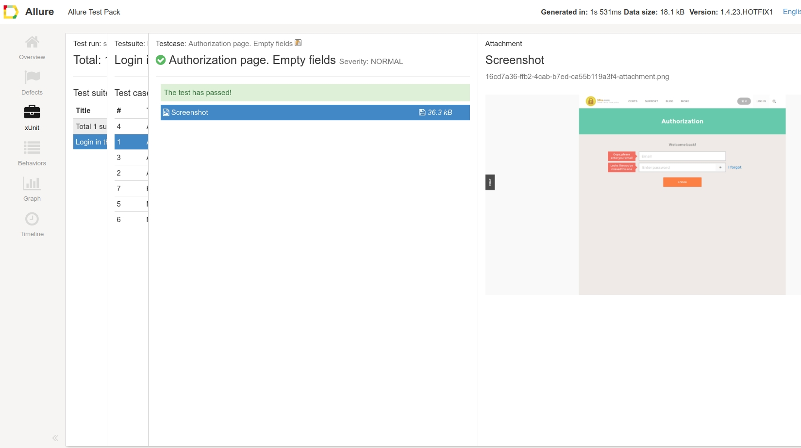

[Protractor](http://angular.github.io/protractor) is an end-to-end test framework for [Angular](http://angular.io/) and [AngularJS](http://angularjs.org) applications. Protractor is a [Node.js](http://nodejs.org/) program built on top of [WebDriverJS](https://github.com/SeleniumHQ/selenium/wiki/WebDriverJs). Protractor runs tests against your application running in a real browser, interacting with it as a user would.

Getting Started
---------------

To get set up and running quickly:

```
apt-get install nodejs
```

```
install npm
```

```
npm install -g protractor
```
or

```
npm install protractor@latest --save (for the latest version)
```

The webdriver-manager is a helper tool to easily get an instance of a Selenium Server running. Use it to download the necessary binaries with:

```
webdriver-manager update (we get the latest version of selenium server and chromedriver)
```
   Note: You should install the version of browser >= 62 version

```
webdriver-manager update (we get the latest version of selenium server and chromedriver)
```
Then you can start up server the following command:

```
webdriver-manager start
```
Project architecture
--------------------

* page

The folder "page" contains all pages which use for writing test cases (loginPage, homePage and profilePage)
In these pages use locators and method PageObject

* steps

The folder "steps" currently contains one method for making screens

* screens

This folder will contain all screens

Run Tests
---------

Also the project contains two file js

```
conf.js
```

```
ex_spec.js (contains all tests according to documents of test-cases)
```

In order to run tests you need to use "conf.js" file for example:

```
protractor conf.js
```

Report
------
First off all we need to add [Allure](https://docs.qameta.io/allure/) to our system
And add the following command

```
npm i jasmine-allure-reporter
```

In this project was added jasmine-allure report. The module of allure plugin can see in "conf.js"

To get the report enough to start up tests

```
protractor conf.js
```

After executing tests we get the report "allure-results" with "xml" files
Then to get report in locally, need to execute the following command

```
allure generate ./allure-results/
```

And we can get the next folder "allure-report"
If we open "index.html" we will see this report


